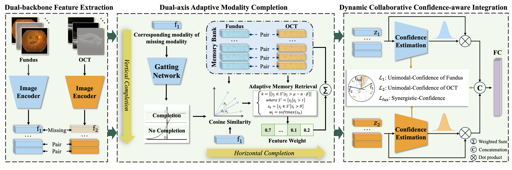

# T<sup>2</sup>ID: Towards Trustworthy Incomplete Modality Diagnosis via Dual-Axis Adaptive Completion and Confidence-aware Integration

<p align="center">
  
  
  
  
  
</p>

---

## News

- **[2026.XX]** Code for **T<sup>2</sup>ID** is released.
- **[2026.XX]** Preprocessed data instructions and training scripts will be updated soon.

---

## Overview

This repository provides the official implementation of:

> **T<sup>2</sup>ID: Towards Trustworthy Incomplete Modality Diagnosis via Dual-Axis Adaptive Completion and Confidence-aware Integration**

T<sup>2</sup>ID is designed for trustworthy multimodal medical diagnosis under incomplete-modality scenarios. Instead of always completing the missing modality or completely avoiding completion, our framework adaptively determines whether completion is necessary and integrates multimodal evidence with confidence-aware modeling.

The main contributions include:

- **Dual-Axis Adaptive Completion (DAA):** selectively determines whether the available modality is diagnostically sufficient and retrieves complementary information when needed.
- **Memory-bank-based Modality Completion:** completes missing modality features using semantically consistent multimodal samples.
- **Dynamic Collaborative Confidence-aware Integration (DCC):** jointly models unimodal confidence and synergistic confidence for reliable multimodal diagnosis.
- **Robust Incomplete-Modality Learning:** supports different missing ratios and missing-modality scenarios across multiple medical datasets.

---

## Framework

<p align="center">
  
</p>

The overall framework contains two key modules:

1. **Dual-Axis Adaptive Completion**
   - Vertical pathway: evaluates whether the available modality is sufficient.
   - Horizontal pathway: retrieves complementary features from a memory bank for missing-modality completion.

2. **Confidence-aware Integration**
   - Estimates unimodal confidence.
   - Models cross-modal synergistic confidence.
   - Dynamically integrates available and completed modality features.

---

## Datasets

We evaluate T<sup>2</sup>ID on three public multimodal medical datasets:

| Dataset | Task | Modalities | Link |
|---|---|---|---|
| Seven-Point Checklist | Skin lesion diagnosis | Clinical image + Dermoscopic image | [Dataset](https://derm.cs.sfu.ca/) |
| MMC-AMD | AMD disease diagnosis | Fundus + OCT | [Dataset](https://github.com/li-xirong/mmc-amd) |
| Harvard30k Glaucoma | Glaucoma diagnosis | Fundus + OCT | [Dataset](https://yutianyt.com/projects/fairvision30k/) |

> We highly recommend using **MMC-AMD** for quick reproduction and evaluation.

---

## Requirements

The main dependencies are listed below:

```bash
torch==1.13.0
torchvision==0.14.0
protobuf==3.20.3
torchcontrib==0.0.2
numpy==1.19.5
pandas==1.2.0
pillow==10.4.0
opencv-python-headless==4.5.3.56
matplotlib==3.6.3
scikit-image==0.18.1
scikit-learn==0.24.1
seaborn==0.11.2
transformers==4.44.2
```

## Quick Start

You only need a few dependencies to quickly launch the model.

```bash
cd model/
python T2ID.py
```

## Usage

Run the main program using Python:

```bash
python main.py
```

## Acknowledgement

This repository is built upon [FusionM4Net](https://github.com/pixixiaonaogou/MLSDR) and [MMDynamic](https://github.com/TencentAILabHealthcare/mmdynamics).

Thanks again for their great works!

## Contact

For any questions, feel free to contact: [Jing.Li2@liverpool.ac.uk](mailto:Jing.Li2@liverpool.ac.uk)
